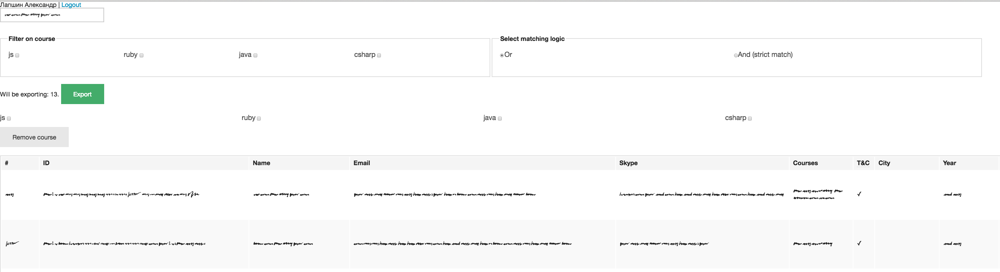
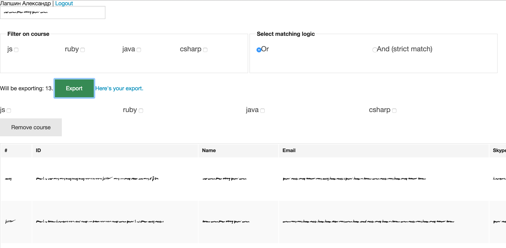
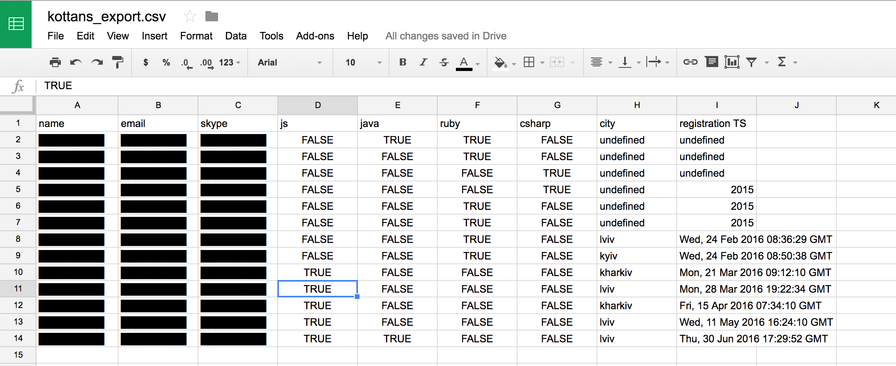
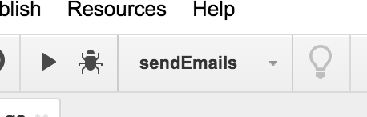

# kottans-course-bootstrap

## Introduction

Welcome!
The repo focuses on providing a high-level frameworkish guide of creating and running a course, supposedly, related to kottans.
You might ask:

> So anyone can run a kottans course?

The answer is **yes** with the following clarifications:
  1. being nice
  2. not taking money* for the course and thus using kottans™ brand for making a profit

    \* There is possible some sort of exceptions which should be agreed upon by most kottans members

### Table of contents

+ [Preface](#preface)
+ [The ingredients for a course](#requirements)
  + [Team](#team)
  + [Shared vision](#shared-vision)
  + [Program](#program)
  + [Venue](#venue)
  + [Students](#students)
+ [Description of actual processes](#workflow)
  + [Announcing course](#announcing-course)
  + [Getting registrations](#getting-registrations)
  + [Sending out test assignment](#sending-out-test-assignment)
  + [Checking test assignments and providing feedback](#test-assignment)
  + [Setting up interview](#setting-up-interview)
  + [Interview && interview feedback](#interview)
  + [Setting up courses](#setting-up-courses)
  + [Homework tracking / check / feedback](#monitoring)
  + [Running the course / workshops](#live-event)
  + [Tracking progress](#tracking-progress)
  + [Gathering course feedback](#gathering-course-feedback)
+ [Useful tools](#useful-tools)

## <a id="preface"></a> Preface

A course creation takes time, physical and material resources. The results of it won't make you famous instantly. You
will not become an IT rockstar or an attractive person. But there is 100% guarantee, along the way you would meet a
great people and get a new knowledge (from a things about people nature & community to productivity and the technology
you love). A course length is not the same. In the past there were a courses from 2.5 to 5 month long. A preparation for
a course, based on an available resources (a team with a program materials) might vary from a week to several months.
So be prepared for a deadline increasing, take enough motivation and patience to finish it and good luck.

## <a id="requirements"></a> The ingredients for a course

+ [a motivated team](#team)
+ [a shared vision](#shared-vision)
+ [a program](#program)
+ [a venue](#venue)
+ [students](#students)

### Team

To start a course you have to find **at least 3 people** - a manager and two coaches.

The manager can work part-time and his/her responsibilities are:
+ registration
+ task handouts
+ solving interview and sponsor related questions
+ setting up and maintaining lecture schedules, progress-tracking pages

The coaches have to be familiar with a course technology at the middle/senior level. It is highly recommended not to
start a course with one coach. There is a good chance of losing her/him at some moment by a personal/work related
unexpected involvement. As the result the course will be stopped and it's quite difficult to bring attendees back after
a pause.

<a id="guests"></a>Along the way, a course can invite a guest speaker. Inviting guest speakers relieve the coaches
from the duty. The students will meet other people in the community and learn their use cases. Invite a person as a guest
speaker if she/he has a more experience in a topic. You can choose from other kottans, gitter communities, speakers at
meetups/conferences. As guest speakers often don't do it on regular basis, be prepared for the next:
+ might forget about the event
+ can change their mind about coming and don't notify the team
+ forget to make an examples and get all required stuff
+ be stopped in the middle (if the event has a time restrictions)

It is a difficult part. To avoid a failure try to contact the guest before one or two days and check every
aspect. As a team member you should backup a guest by jumping in and covering the topic or change the course
program and shift the topic for later.

There were cases when a guest speaker was from another city via google hangouts. Keep in mind, this is less effective.

### Shared vision

The team has to agree the key points:
+ the audience - for whom the course should be most beneficial. They could be language switchers, junior developers without
experience, etc.
+ the reason - why do the course have to be? For example, course "Introduction into Ruby & RoR" teaches people to write
a basic Ruby scripts and works with the framework.

Taking to account the points you will find out the minimal knowledge/skillset required for a course.

### Program

The next step in starting a course is filling a program. Usually a course has 2 lectures per week. A lecture takes an
1.5 hours. A workshop is every two weeks for 4-6 hours each. There's a homework related to the topic as well.

In the previous courses we were faced the conflict among:
+ teach all core important things™ in depth
+ a desire to explain everything from the bottom to the top
+ not to make an endless course

Take to note the next recommendations:
+ don't plan a course for more than 16 weeks. Try reduce a scope by self-education, good videos, defining the
core aspects needed to understand the technology, etc
+ as there are 2 lectures per week try to cover a big topic during a same week rather splitting it across a weekend
+ workshops are optional, so skipping a workshop shouldn't harm a student learning course in future
+ workshops usually take place on weekend when people tend to prefer to relax rather than attend a workshop. As the
result think of this time as an opportunity to do something fun, hack on something small, build a functional
prototype/app, play with a niche. In short - bring some fun to the course and talk about related, but not the core
things. A few examples:
  + if it's a ruby course try to look at the ruby internals
  + for a js course you can play with [Three.js](http://threejs.org)
+ think about a [guest speaker](#guests) for a topic
+ plan for the start and end sessions
+ as there are 2 lectures in a week a homework after the first one might be 'lighter' and be less time consuming (read a
  docs/articles/books or view videos) and a bigger homework should be assigned for the weekend break

After that you will need to:
  1. Create the final list of topics
  2. Break up the topics and the workshops by week with calendar timeline
  3. Put down high-level contents of each session. A sample for a js course:
  ```
    Topic: HTML
    + meta tags, semantics, document outline, forms, input elements, tables)
    + Markup languages
    + Before HTML5: The history of HTML
    + HTML5: The Semantic Web
    + Beyond HTML5
    + [PostHTML]
    Topic: CSS    #1
    + CSS 2.1 (margin collapse, box model, inline vs block, floats/clears)
    Topic: CSS    #2
    + CSS 3 (flexboxes, transitions/animations, mention box layouts, grids…)
  ```
  4. Assign the primary and the backup coach
  5. Discuss the fallback strategy in case someone is sick / not showing up / etc. (Identify, which topics can be moved
    around, what can be skipped and revisited later in other topics, etc)
  6. Get ready with some materials for the core topics for sure (usually, that would be
    [slides](http://kottans.org/#slides)). You will want to have those ready 2 weeks in advance before the actual
    lecture for everyone to review/provide feedback.

### Venue
Usually, a friendly company would be hosting our initiative's course. Sometimes we know the people who know the people on the inside, sometimes our fellow kottans are owning/working for such company, sometimes you have to go and ask.
Other that getting necessary info via word of mouth, you can try using local development communities to find relevant information (might be looking for topics like [this](https://dou.ua/lenta/articles/gde-provesti-meropriyatie/), [this](https://dou.ua/lenta/articles/welcome-to-companies-4/) or [this](https://dou.ua/lenta/articles/welcome-to-kyiv-companies/)).
Venue requirements:
+ enough space for all students and coaches
+ projector / big screen to show presentation / live coding (although could bring your own projector, etc.)
+ stable internet connection (although backup option could be using 3g modems, cell phone tethering etc.)
+ WC / water in accessible proximity, optionally cookies/snacks/food
+ being free for the time of the course
+ optionally: microphone
+ optionally: air conditioning

### Students
A group might vary in size, given the actual course mission, venue, speakers level etc. Given we are usually targeting offline format, it's usually most productive to have 15-25 students.

Usually, group would include motivated and curious future kottans or alumni kottans that are thirsting for new skills. To achieve this, prior to course, there's
  1. a test assignment being sent out to everyone who wants to attend course
  2. an in-person interview to assess some social skills, motivation, and level of applicant

Be aware that students tend to drop out the course. Drop rate might vary per course, based on its length, complexity, engagement and may vary from 10-15% to 66-80% (just a ration of students that are not making it till the end). Apart from personal reasons students might be dropping out, there's also a possibility that coaches can decide to exclude someone from the course in case of not keeping up with homeworks for a long time (usually, baseline is you can have at most 3 home assignments not done until coach would interfere) or other reasons (rude behaviour?).

## <a id="workflow"></a> Description of actual processes

>_Quick tip on managing files: create google drive folder for a course and share it with everyone involved. Store artifacts there_

### Announcing course

Usually, you would want people to know there's a course coming.
You might want to
1. Do a post on facebook and contact your local communities. For example, in Ukraine it may be [dou](https://dou.ua). Like [this](https://dou.ua/forums/topic/14054/), [this](https://dou.ua/forums/topic/8181/) or [this](http://ain.ua/2016/02/23/634216) etc.
2. Tweet and get retweet / post from [@kottans_org](twitter.com/kottans_org) account.

### Getting registrations

People are applying for the course(s) through [our site](http://kottans.org/#contact).

1. Get an access to [application monitor](http://kottans.github.io/application-monitor).
2. Set corresponding filters, matching a subset of students you are interested in. Be aware it's somewhat laggy and slow.

3. Click export. Supposedly, if you exported student for some course, you would like to check that language checkbox & click 'Remove', so that person would not show up for the same language filter in the future (we want to remove people from the list so that they will get application email only once. If they want in next year, they should register again).

4. You will get spreadsheet  that can be further used. Usually, you would do several exports (as people tend to start registering when the course is announced) and merge those together.

There's also a possibility you would be creating a course that we never had before and thus you might need to modify [application monitor](https://github.com/kottans/application-monitor) to support corresponding columns / filtering / export.

> _Note: we previously also had 'beta'-course, that wasn't available for a wide audience but was more of 'by kottans for kottans'. In that case, there's a different flow for getting registrations/test task/interviews._

### Sending out test assignment

You will need to have test assignment text ready.
Sample test assignments from JS course few years ago: [Contact Book](https://docs.google.com/document/d/1a0q0TQDEShK_3xzUEeUWe4Vuipc4haMXzZyIDTDslvk/edit?usp=sharing), [Gaussian solver](https://gist.github.com/programulya/659481e897de02408d57). Quantity and complexity of tasks depend solely on the quantity of participants and mission. Be sure to agree in the team on general criteria used to measure completeness/quality of the solution.
You will also need a template for email. Sample email from a few years ago can [be found here](https://docs.google.com/document/d/1NdzuedOws88hTeMejvFjnLY0E6vIXGeEcmjzkPLNoME/edit?usp=sharing).
Set up the deadline for handing in test assignments (usually, one month from the day of sending out test assignments) and the form of completed test assignment you expect to receive (for code that would be a github repo with proper README to start and run the project). Think about adding bonus points for deployed app (heroku / etc. for server apps or github pages for static web apps).

#### Doing actual mailing using google scripts
You can use ability of google scripts to send emails using simple script and google spreadsheet.
I. Create google spreadsheet. Fill in a column of emails and possibly names / personalized message if you want to in neighbouring cell.
something like

|   | Email | Name |
|---|-------|------|
| 1 | a@b.c | John |
| 2 | b@c.d | AzAz |

II. Tools -> Script Editor, create script, similar to following:
```javascript
function sendEmails() {

  var sheet = SpreadsheetApp.getActiveSheet();
  /*
    actually could rewrite this to use something like
    var activeCell = sheet.getActiveCell();
    while (activeCell.getValue() != '') {
      // do things with current active cell which will be looping
      // over cells while they are not empty
      activeCell = activeCell.offset(1, 0);
    }
  */
  var startRow = 2;  // First row of data to process
  var numRows = 60;  // Number of rows to process

  var dataRange = sheet.getRange(startRow, 1, numRows)
  // Fetch values for each row in the Range.
  var data = dataRange.getValues();

  var subject = "Sample subject goes here";
  // TODO: need to test whether google script accepts template strings
  // TODO: change sample message?
  var message = "<html><body>"
  + "<p>Привет!</p>"
  + "<p>Осталась неделя до nodeschool в Киеве. Для того чтобы воркшоп прошел с максимальной пользой для каждого участника</p>"
  + "<p>мы подготовили краткое <a href='https://gist.github.com/sejoker/2c34f1b12c435d97cc0f'>руководство</a> для настройки вашей среды.</p>"
  + "<p>Установленный node и npm сэкономит время для быстрого старта в следующую субботу.</p><br><br>"
  + "<p>Все вопросы по установке оставляйте в комментариях, мы постараемся оперативно отвечать.</p>"
  + "<p>Хороших выходных,</p>"
  + "<p>организаторы ивента.</p>"
  + "</body></html>";
  Logger.clear();
  data.forEach(function(row, i, all){
    var emailAddress = row[0];  // First column
    // var name = row[1] - can get name here
    Logger.log('Will send email #'+ i + '  to: ' + emailAddress + ' of: ' + all.length);
    if (i === 1) { // sending first email to personal email for content checking
      MailApp.sendEmail('john@kottans.org', subject, "", {htmlBody: message});
    }
    MailApp.sendEmail(emailAddress, subject, "", {htmlBody: message});
  });


  // sending summary of processed items to own address
  var body = Logger.getLog();
  MailApp.sendEmail('john@kottans.org', 'Addresses we mailed to', body);
  Logger.clear();
}
```


III. You can now click ▶︎ button and run your script



which would require you to authorize google account and send letters from it (you'll see it in your inbox).

> __NOTE: there's daily quota for how many emails single account can send from google scripts. Last time we checked it was 100 emails. Which means that if you have more applicants you will have to either do batches for several days or use several accounts.__

#### Doing actual mailing using mailchimp

You can also use [mailchimp](http://mailchimp.com) or similar service for mailing campaigns. It will usually mean you won't have to write setup code and work around google scripts email limitations, but they will require payment.

### <a id="test-assignment"><a/> Checking test assignments and providing feedback

Store references to applicant, his/her email (possibly skype/gitter), and test assignment. Google spreadsheet might work for this, as you will need to add comments and mark items as checked/rejected. Comments can be send right away using email/skype/gitter. Indicate that feedback was sent for other coaches to be aware.
Notes here:
+ be nice, provide constructive feedback. Follow best code review practices
+ be aware that person that did the assignment might never written code before – be forgiving about design solutions, code constructs, etc.
+ hunt down logical fallacies, bad-bad practices, inconsistencies (mixing tab and spaces would usually mean person copypasted code, having direct DOM interaction in one place and jquery in other part, etc).
+ keep in mind that broken functionality is worse than ugly code
+ check for plagiarism. Review commit history, do a quick google search
+ note whether there are some small lovely details (those are bonus points!) that might indicate person's determination to get on board.

Send feedback out. Reviewing progress after might get you a better understanding of person's willing to get to the course, ability to comprehend feedback, etc.

After deadline passing you will need to short-list applications based on your team's idea of the mission and level of applicants. Sometimes you might cross out someone because s/he's too good or because s/he's too bad.

> Note: how long should be the _short_ list? Depends on amount of applications and how many people will take part in interviewing process. Our guess would be it takes 7-12 minutes to talk to one person. It means you will be able to talk to ~6 people an hour. Historically, interviews would be spread across multiple days and totaling in around 8-10 hours, which means you can have ~50 people there if you are doing it in single-thread.

### Setting up interview

To get an interview, you will need a __venue__. Sometimes, main venue might work, as sponsoring company will welcome you to occupy one of their meeting rooms. Sometimes, you have to work it out on your own. Local co-working might provide discounts / free of charge access for trainers doing interview as interviewee will have to pay for their stay in space.
You will need to set __day and time__. There's a possibility to have interviews spread across multiple working day evenings or be on weekends only, up to you.
You will need to set up some sort of __preliminary schedule__. Assuming 5-6 people an hour, send out invites for specific hour of the day (so, first 5 people will get invite for 10:00, following 5 - 11:00, and so on). You can try fine-grain it, but usually, planned schedules tend to get off rail really quickly.
You will need to inform students. You might share the spreadsheet and let people try to figure all the issues out themselves (switch with someone else, etc), or just send the invite directly using email and deal with outstanding cases yourself.
Note, there will be someone, who won't be able to attend in person. Consider doing an interview using hangouts/skype either before or after all other interview session, but try not to have too much time between those so your memories would be fresh.

### <a id="interview"></a> Interview && interview feedback

Be sure to have enough water in close proximity and more than one person doing the interview. It will let you take turns in interviewing (and you will be talking a lot, and it's exhausting) and have multiple opinions for a candidate that can be somehow averaged afterwards.
During interview tell about course program, ask person

1. What's his/her current job/study place? Role, responsibilities, etc.
2. What's his/her motivation to attend Kottans course?
3. What's his/her motivation to chose this specific technology? Has s/he tried studying by themselves? What were the obstacles, previous studying experience, etc.
4. What was the hard / easy part about test assignment? Why was it done the way it was done? Discuss technical side of solution, ask about work done after feedback provided.
5. What person expects to get after passing the course?
6. What person wants to contribute to our community?
7. Given this and this schedule, will person be able to attend course, do all the homework assignments, etc.? Let them tell you how that will fit into their everyday routine.
> Note: you might be talking to a person and realize they are too skilled to be studying. You can suggest person joining the coach team, and attending all the lectures and helping out with lectures on their own.

Tell people when the results of interview would be out (keep in mind those people interviewing remotely). Be welcoming and let them know your possible plans for other courses / events, gift them a kottan's sticker, etc. These people spent their time and completed your test assignment, they deserve some 🐱♥️.

You are interested in people motivation/determination, openness, willing to contribute back, time management skills. Try summing all this into single digit and put it next to candidate name in spreadsheet. Have other interviewers do that exercise.

After going through interview process a challenge appears – you need to shortlist a shortlist. There are always obvious outstanders – be it one way or another.
One possible way would be to average the scores for each person, sort in descending order and drawing a line.

Send out two packs of emails: the happy ones and sad ones.
Sad one should state that people didn't make it to the group, but should keep in touch. Possibly, share list of resources that will be useful for further self-education.
Happy emails would be about date and time of first lesson, place, prerequisites.

### Setting up courses

To actually setup courses, you will need to setup

1. Group chat or other means of communication
2. Progress tracking / group list
3. Calendar

#### Group chat

In the past we had experience with using skype and [gitter](http://gitter.im/kottans) for text communication. It's useful to ask a question (btw, you are welcome to ask questions related to this document or any other in [our main channel](http://gitter.im/kottans/kottans.github.io)), make an announcement, share link / code snippet (whether that's during lecture or in spare time).
We did experiment with using slack, but that wasn't too successful.
All these would be free (or have free plans), but they might have downside to them (limited history, sync across devices, limited number of participants in private channel).

#### Progress tracking / group list

TODO: fill this out

#### Calendar

TODO: fill this out

### <a id="monitoring"></a> Homework tracking / check / feedback

There are two main models of accepting / tracking homeworks:

1. Single repo that all the students fork and send pull request to.

```
.
├── README.md             # First point of entry. List of students / dates / topics / kottan site link?
└── tasks
    ├── README.md         # All the tasks/problems description in markdown, living document
    ├── student1          # Github username of student
    │   ├── week1-task1   # folder that contains student's solution
    │   ├── week1-task2
    │   └── week2-task1
    └── student2
        ├── week1-task2
        └── week2-task1
```

Students get to create PRs to add their solution to the repo in corresponding folder.
Might be useful to add all students to github team that has write (?) access to the repo.

PROS:
+ PR commenting for providing feedback
+ No need to track multiple repos
+ Coaches can create separate issues if they find something and assign to corresponding student
+ Students can do peer review as everything is in the open
+ Students learn how to work with github / PR / pulling changes from remote

CONS:
+ Students might have temptation to look at other people's solutions
+ If someone messes up the repo/history, he does it for everyone
+ Lots of notifications spamming everyone, who is 'watching' the repo
+ Lots of folders – might be hard to track separate student's activity
+ Work won't get to master until approved by someone
+ Students don't own repo with their homework – might pose issues for setting up CI, etc

2. Repo per student.
Each students creates a repo, documents that via PR to course repo (more about it below) and stores solutions for the problems in separate folders.
```
├── week1-task1
├── week1-task2
├── week2-task2
└── week2-task1
```
In that case homework usually is assigned by opening an issue in student's repo using our beloved 😼[tiny-kottan](https://github.com/tiny-kottan) and github api from google scripts and homework sheet (more about that below).

PROS:
+ Students own the repo, responsible for setting it up and maintaining
+ Count of open issues = count of not (fully) done homework assignments
+ Everyone gets personal notification when they have a new assignment
+ No need to get lots of notifications

CONS:
+ Setup for opening issues
+ Decentralized bookkeeping (who did what where)
+ No ability to reopen / close issue by the coach (although students could add coaches and tiny-kottan as collaborators…)

We usually used option #2. Historical reasons.

To track overall progress, we would use github api and google spreadsheet's scripts
Script:
```
// githubHandlerRepo
function getOpenIssues(githubHandlerRepo, counterVar) {
  var url = [
    'https://api.github.com/repos/',
    githubHandlerRepo, // ~ string "%organizationName%/%repoName%
    '/issues?state=open&',
    'access_token=%access_token_here%' // increases github rate limit https://help.github.com/articles/creating-an-access-token-for-command-line-use
  ].join('');
  var options =
  {
    // Get fresh data at least once in 4 minutes
    headers : {'Cache-Control' : 'max-age=240'}
  };
  var response = JSON.parse(UrlFetchApp.fetch(url, options));

  return response.length;
}


function getGithubUrl(githubHandlerRepo) {
  return githubHandlerRepo ? "http://github.com/" + githubHandlerRepo : ''
}

function getUsername(githubHandlerRepo) {
  return githubHandlerRepo ? githubHandlerRepo.split('/')[0] : ''
}
function getGitterUrl(githubHandlerRepo) {
  return "https://gitter.im/" + getUsername(githubHandlerRepo)
}

function updateCounter() {
   var sheet = SpreadsheetApp.getActiveSpreadsheet().getSheetByName('Progress');
   var cell = sheet.setActiveSelection("J1");
   cell.setValue(cell.getValue() + 1)
}
```

In spreadsheet you would have something like following

|   |   A   |  B   | … | J  |
|---|-------|------| --| -- |
| 1 | username/repo | open issues count | … | 2
| 2 | student1/homeworks | =getOpenIssues(A2, $J$1) | … |
| 3 | student2/homeworks | =getOpenIssues(A3, $J$1) | … |

`J1` is a counter used to work around google spreadsheet not initing any AJAX request if function is invoked with same params.

For structure like in #1 you would probably want to filter issues by assignee to get same metric.

### <a id="live-event"></a> Running the course / workshops

Other than setting
4. Set up recording / airing of lectures

### Gathering course feedback

Getting feedback is generally a good idea.
In order to get *relevant* feedback from students it is appropriate to hand out surveys e.g through Google Forms (Survey example [here](https://docs.google.com/forms/d/e/1FAIpQLSeYJyYhET-JXTBznzmsDleUg9HFMy-nnzzVaHGu0OlL9oQsSg/viewform))
after each lecture\workshop.
```
Survey sample for each lecture:
- Choose lecture (dropdown)
- How much new info did you find through lecture
- Please rate the speaker
- What did you like about speaker's talk?
- What would you change in speaker's talk?
- Please rate the lecture's topic
- What did you like about lecture's topic?
- What would you change in lecture's material?
- Would you likely to dig deeper into topic?
- How likely will you practice the knowledge you gained from lecture?
```
You can get somehow relevant rating of lecture after subtracting 20% of top-high and bottom-low ratings.
At the end of the course the final survey is a must.
```
- What lectures were good?
- What lectures were not so good?
- How did course meet their expectations?
- What would the student change in course?
```
If course team is not yet buried in feedback it would be nice to have a pre-course survey to gather student's **expectations and background**.

## Useful tools
TODO: fill out
